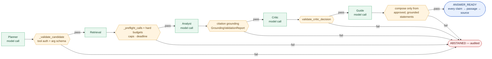

# Architecture diagram — acquisition → retrieval → agents → deterministic validation

This is the **visual companion** to [`request-trace.md`](./request-trace.md). That
document traces one real request (`POST /api/investigations/build`) through the code,
function by function; this one draws the same path. Every node here is anchored to the
same module/function the trace verified against source, so the picture and the prose
cannot drift apart. The diagrams render natively on GitHub.

The system is deliberately **not an autonomous agent swarm** (ADR-003): it is an
explicit pipeline whose every model call is wrapped by a deterministic gate.

---

## 1. The full request lifecycle

One flagship "search any topic" request: acquire sources on demand, build a corpus,
investigate it with four bounded agents, and stream a cited answer or a principled
abstention.

```mermaid
flowchart TB
    client(["Browser"])

    subgraph entry["HTTP entry · api/app.py"]
        route["build_and_investigate()"]
    end

    subgraph phaseA["① ACQUISITION — synchronous, in the request thread"]
        direction TB
        bs["CorpusBuildService.build()<br/>build_service.py"]
        scope["scope_years() → DiscoveryQuery<br/>era-aware window · ADR-005"]
        disc["discover_sources() + relevance ranking<br/>discovery.py · drops namesakes"]
        fetch["fetch full text → content-addressed cache<br/>fetch_cache.py · partial-ok"]
        chunk["chunk into Passage records<br/>chunking.py"]
        embed["embed — optional local vectors<br/>OllamaEmbedder · embeddings.py"]
        enrich["enrich — optional events/timeline/territory"]
        build["corpus_builder → PackageBackedCorpus<br/>corpus_builder.py · same type as fixtures"]
        bs --> scope --> disc --> fetch --> chunk --> embed --> enrich --> build
    end

    subgraph handoff["② HANDOFF — request → run record → worker"]
        direction TB
        rec["_make_run_record()<br/>AgentRunRecord + CorpusSnapshot"]
        submit["AgentRunManager.submit()<br/>single-worker ThreadPoolExecutor(max_workers=1)"]
        rec --> submit
    end

    subgraph phaseB["③ INVESTIGATION — async · LangGraph StateGraph · graph.py"]
        direction TB
        planner["planner_node<br/>InvestigationPlanner.plan() — 1 model call"]
        retrieval["retrieval_node<br/>InvestigationRunner.execute_initial()<br/>+ guaranteed retrieval floor"]
        analyst["analyst_node<br/>EvidenceAnalyst.analyze() — 1 model call"]
        final["finalization_node → finalize()<br/>critic → [≤1 follow-up] → guide"]
        planner --> retrieval --> analyst --> final
    end

    result{{"Terminal: ANSWER_READY / ABSTAINED / FAILED"}}
    stream["bounded event journal → SSE<br/>GET /api/agent-runs/&#123;id&#125;/events · _event_stream()"]

    client -->|"POST /api/investigations/build"| route
    route --> bs
    build -->|"registered corpusId"| rec
    submit --> planner
    final --> result

    planner -. "abstain / plan invalid" .-> result
    retrieval -. "unusable / failed" .-> result
    analyst -. "ungroundable draft" .-> result

    phaseB -. "every stage signal" .-> stream
    stream --> client

    classDef acq fill:#e8f0fe,stroke:#4a76d4,color:#12325f;
    classDef inv fill:#e9f7ef,stroke:#3aa76d,color:#14472e;
    classDef gate fill:#fdECEC,stroke:#d46a6a,color:#5f1212;
    class bs,scope,disc,fetch,chunk,embed,enrich,build acq;
    class planner,retrieval,analyst,final inv;
    class result gate;
```

**Read it as four bands:** ① acquisition turns an arbitrary topic into a registered
corpus, ② the handoff freezes provenance into an immutable run record and enqueues it on
the one-at-a-time worker, ③ the LangGraph state machine runs the four agents, and the
dotted edges are the **principled exits** — the run abstains rather than fabricates.

---

## 2. The deterministic-validation spine

This is what makes Chronicle auditable rather than "trust the LLM": **each model call is
bracketed by a deterministic gate**, and any gate can end the run in a recorded,
principled abstention.

Over a thin, auto-acquired corpus on a small local model, the most common exit is the
**analyst grounding** gate — the honest failure mode, measured and scoped in
[`../delivery/live-investigation-abstention-gap.md`](../delivery/live-investigation-abstention-gap.md).

---

## Node → source anchor

Every node above maps to a verified location (same anchors as `request-trace.md`):

| Node | Module | Function / symbol |
|---|---|---|
| HTTP entry | `api/app.py` | `build_and_investigate()` |
| Acquisition bridge | `acquisition/build_service.py` | `CorpusBuildService.build()` |
| Pipeline | `acquisition/pipeline.py` | `AcquisitionPipeline.run()` |
| Discovery + ranking | `acquisition/discovery.py` | `discover_sources()`, `_select_by_relevance()` |
| Cache | `acquisition/fetch_cache.py` | `FetchCache` |
| Chunking | `acquisition/chunking.py` | `chunk_source()` |
| Embedding (optional) | `acquisition/embeddings.py` | `OllamaEmbedder` |
| Corpus build | `acquisition/corpus_builder.py` | `build_corpus()` → `PackageBackedCorpus` |
| Run record | `api/app.py` | `_make_run_record()` |
| Worker queue | `ai/orchestration/manager.py` | `AgentRunManager.submit()` / `_execute()` |
| Workflow | `ai/orchestration/graph.py` | `LangGraphAgentWorkflow.run()` (compiled StateGraph) |
| Planner | `ai/agents/planner.py` | `InvestigationPlanner.plan()` |
| Planner gate | `ai/agents/planner.py` | `_validate_candidate()`, `_clamp_result_limits()` |
| Retrieval | `ai/orchestration/runner.py` | `InvestigationRunner.execute_initial()` |
| Retrieval floor | `ai/orchestration/runner.py` | `_augment_with_floor()` |
| Retrieval gate | `ai/orchestration/runner.py` | `_preflight_calls()`, `_execute_calls()` |
| Analyst | `ai/agents/analyst.py` | `EvidenceAnalyst.analyze()` |
| Analyst gate | (grounding) | `GroundingValidationReport` |
| Critic | `ai/agents/critic.py` | `HistoricalCritic.review()` |
| Critic gate | `ai/agents/validation.py` | `validate_critic_decision()` |
| Guide | `ai/agents/guide.py` | `InvestigationGuide.compose()` |
| Streaming | `api/app.py` | `_event_stream()` → `manager.events()` |

## See also

- [`request-trace.md`](./request-trace.md) — the prose walkthrough this diagram visualizes.
- [`system-overview.md`](./system-overview.md) — the three-tier deployment shape.
- [`ai-agent-architecture.md`](./ai-agent-architecture.md) — the four-agent contract in depth.
- [`../decisions/ADR-003-llm-agent-system-is-product-core.md`](../decisions/ADR-003-llm-agent-system-is-product-core.md) — why explicit state machines, not a swarm.
